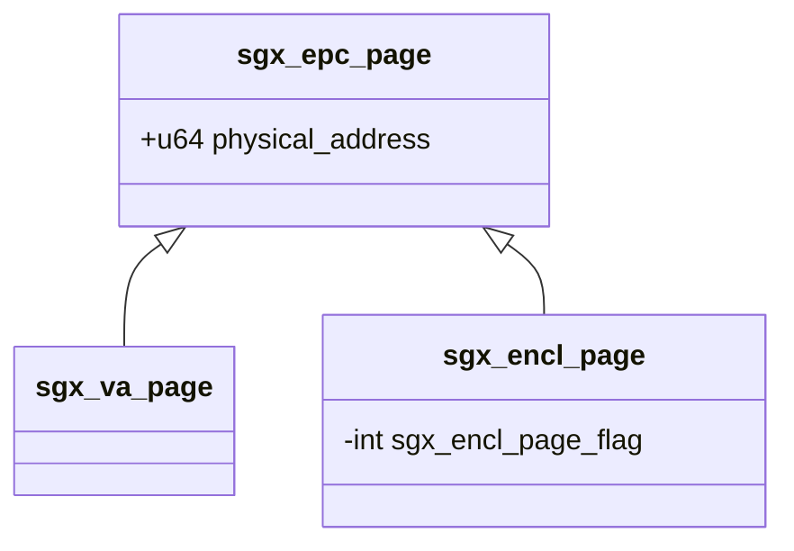

# 内存

首先我们需要一个struct来描述每一个EPC页。一共128M内存，4K一个EPC页，所以一共需要32K个struct。这个struct称为sgx_epc_page. 他里面的字段只有一个，是物理地址。

每个enclave struct需要管理他所拥有的内存页，但是如果直接哟你欧冠sgx_epc_page 不太合适，因为还需要记录一些其他信息，比如页的类型，所以有另一个struct： sgx_encl_page,来描述每一个enclave所拥有的页。他有一个指针指向 sgx_epc_page 。 如果还没分配到 sgx_epc_page , 指向的就是NULL

在遇到swap的时候，需要version array来记录交换出去的页的一些信息。所有的version array集中在一个页上，这个页称为VA page,对应的数据结构是sgx_va_page。每个sgx_encl_page 在一开始就要找到一个sgx_va_page和在这个页上的偏移量。

## Q1： 如何从一个虚拟地址找到一个页？

用radix tree

radix tree类似于trie. 功能是高效的实现key是整数（int,long long）的map.

在内核中，radix tree用来记录缓存。一个大文件可能一部分已经缓存到内存中了，但是这个记录（偏移量->page）该怎么维护？就是用radix tree的

在linux-sgx-driver中，radix tree的功能是从虚拟地址找到一个页（address->sgx_encl_page）。

当一个EPC被交换出去时，radix tree并不会删除条目。所以当一个页被交换进来时，radix tree一定会有这个条目

------

当一个页被交换出去时，sgx_encl_page内的epc_page指针会变成NULL